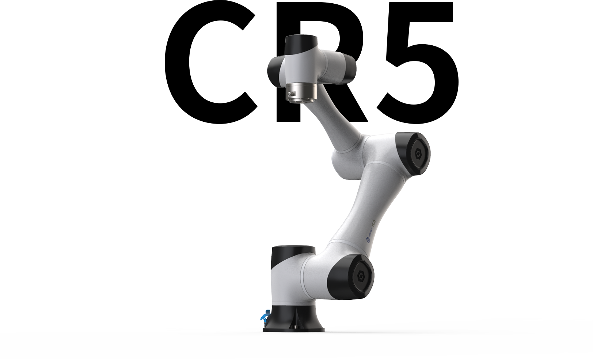
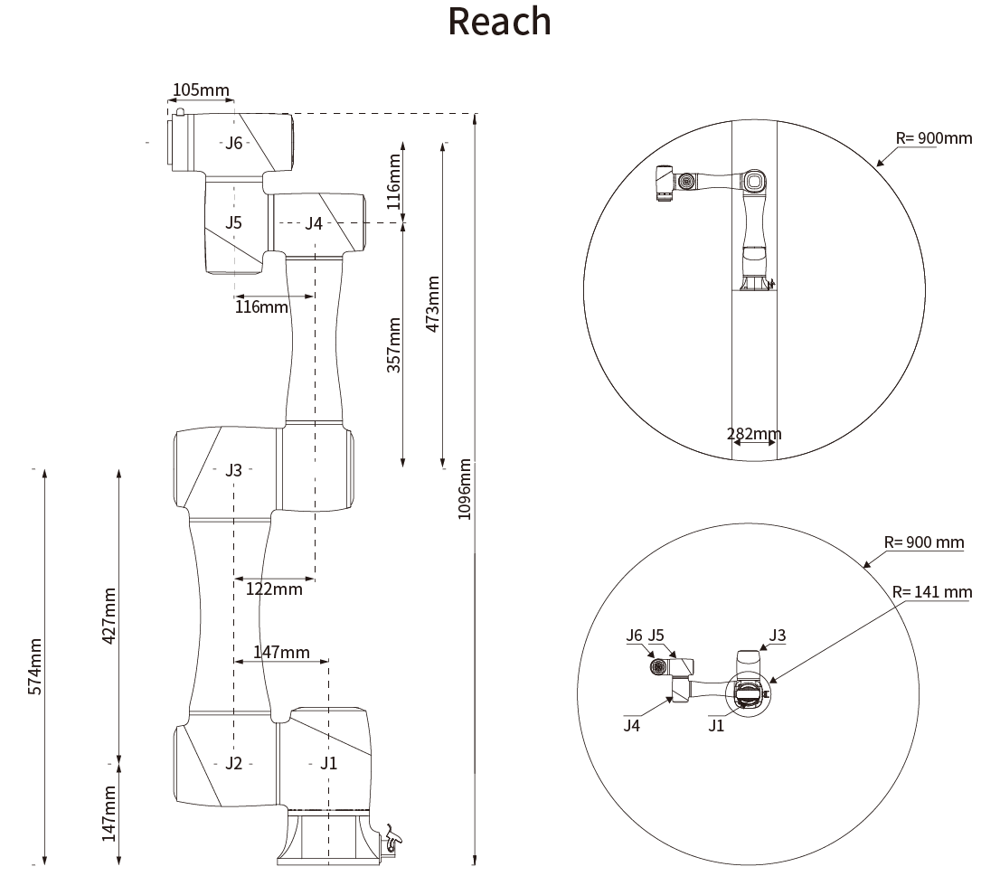

# Dobot CR5 Resources

Resources to aid Robotics Engineering development for the [Dobot CR5] using [ROS][ROS Answers] and [Gazebo][Gazebo Answers]

<table class="table-hover table-bordered table"><tbody><tr><th>Product Name</th><td colspan="2">DOBOT CR5</td></tr><tr><th>Weight</th><td colspan="2">25kg</td></tr><tr><th>Maximum Payload</th><td colspan="2">5kg</td></tr><tr><th>Max Reach</th><td colspan="2">1096mm</td></tr><tr><th>Rated Voltage</th><td colspan="2">DC48V</td></tr><tr><th>Maximum Speed of TCP</th><td colspan="2">3m/s</td></tr><tr><th rowspan="6" style="vertical-align: middle;">Joint Ranges</th><td>J1</td><td>±360°</td></tr><tr><th>J2</th><td>±360°</td></tr><tr><th>J3</th><td>±160°</td></tr><tr><th>J4</th><td>±360°</td></tr><tr><th>J5</th><td>±360°</td></tr><tr><th>J6</th><td>±360°</td></tr><tr><th rowspan="2" style="vertical-align: middle;">Maximum Speed of Joints</th><td>J1/J2</td><td>180°/s</td></tr><tr><th>J3/J4/J5/J6</th><td>180°/s</td></tr><tr><th rowspan="4" style="vertical-align: middle;">End-Effector I/O Interface</th><td>DI</td><td>2</td></tr><tr><th>DO</th><td>2</td></tr><tr><th>AI</th><td>2</td></tr><tr><th>AO</th><td>0</td></tr><tr><th>Communication Interface</th><td>Communication</td><td>RS485</td></tr><tr><th rowspan="5" style="vertical-align: middle;">Controller I/O</th><td>DI</td><td>16</td></tr><tr><th>DO/DI</th><td>16</td></tr><tr><th>AI</th><td>2</td></tr><tr><th>AO</th><td>2</td></tr><tr><th>ABZ Incremental Encoder</th><td>1</td></tr><tr><th>Repeatability</th><td colspan="2">±0.02mm</td></tr><tr><th>Communication</th><td colspan="2">TCP/IP, Modbus, EtherCAT,WIFI</td></tr><tr><th>IP Rating</th><td colspan="2">IP54</td></tr><tr><th>Temperature</th><td colspan="2">0~45°</td></tr><tr><th>Power</th><td colspan="2">150W</td></tr><tr><th>Materials</th><td colspan="2">Aluminum alloy, ABS plastic</td></tr></tbody></table>

[Dobot CR5]: https://www.dobot.cc/products/content-cr5-spec.html
[ROS Answers]: https://answers.ros.org
[Gazebo Answers]: https://answers.gazebosim.org